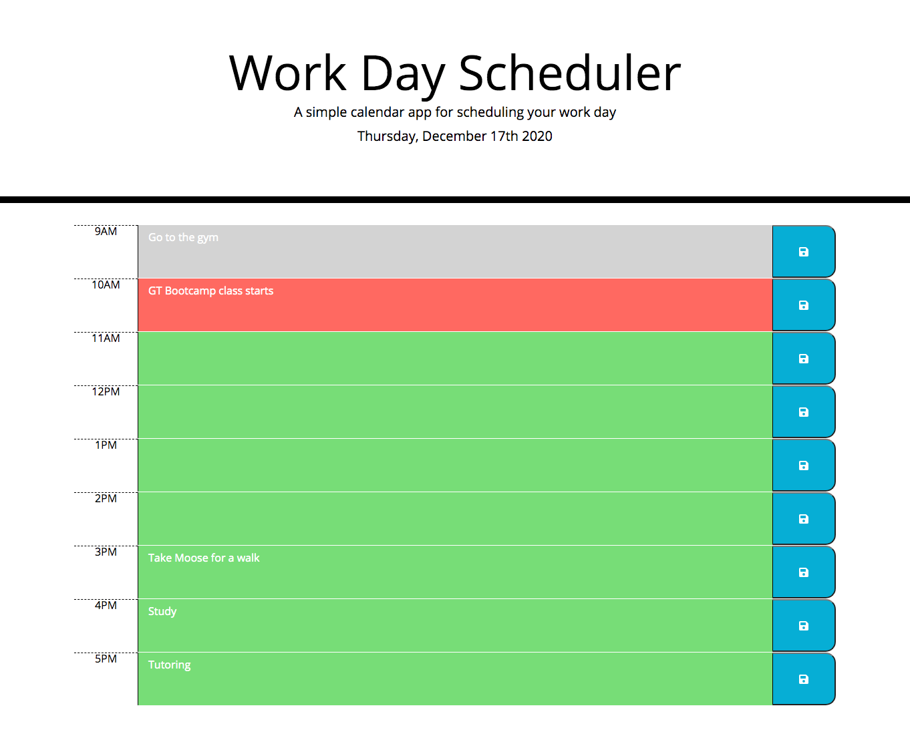

# Day Planner

## Description
[Day Planner](https://jeanarose.github.io/day-planner/) is a simple web application designed to store important dates and information for the work day. Day Planner is useful because all inputs can be saved to local storage and therefore accessed by the user after the browser has been refreshed or closed. This application utilizes jQuery, DOM manipulation, Moment.js, Bootstrap, and event listeners to yield a responsive and dynamic product. The following components were used during the development of Day Planner:

* jQuery DOM manipulation to create elements on the page, specifically each time block
* A for loop to iterate over an array of hours to dynamically create each time block
* Moment.js to display the date at the top of the page and the hours on each time block 
* An event listener for each save button that when clicked, stores the text input to local storage 
* Data attributes that were used to pair each text input to the time in local storage. This was critical in order to display each text input with the corresponding hour after the page is refreshed or the browser is closed.
* Bootstrap design to ensure responsiveness 
* Font Awesome to create the save button icon

View the deployed application here: https://jeanarose.github.io/day-planner/

## Day Planner

## Table of Contents 
* [Installation](#installation)
* [Usage](#usage)
* [Credits](#credits)
* [License](#license)
* [Tests](#tests)

## Installation
1. Go to the [GitHub repository for Day Planner](https://github.com/jeanarose/day-planner).
2. Click the green **Code** button.
3. Copy the SSH key.
4. In your terminal, go into the directory that you want to host Day Planner. 
5. Use the command **git clone [insert SSH key URL]** and click **Enter** (*Requires Git*).

## Usage
Day Planner can be used to store and save dates, todos, or any work-day related information. Of great use is the visual change of the time blocks depending on if an event is past (grey), present (red), or future (green).

## Credits
The following people contributed to the success of this application. You can view their GitHub profiles by clicking on their names:
* [Jonathan Watson](https://github.com/jonathanjwatson)
* [Pete Kriengsiri](https://github.com/pkriengsiri)
* [Peter Colella](https://github.com/petercolella)
* [Molly McCollum](https://github.com/mollymccollumwx)

The following sites were used to find code to make Day Planner function properly:
* [Font Awesome: ](https://fontawesome.com/icons/save?style=solid)Save button icon
* [Moment.js](https://momentjs.com/docs/)
* [MDN: ](https://developer.mozilla.org/en-US/docs/Web/API/Window/localStorage)Local storage
* [jQuery Documentation: ](https://api.jquery.com).attr() and .hover() methods
* [Stack Overflow: ](https://stackoverflow.com/questions/24687431/using-jquery-attr-to-set-css).attr()
* [Stack Overflow: ](https://stackoverflow.com/questions/25770590/change-color-when-hover-a-font-awesome-icon)Change Font Awesome icon color on hover

## License
MIT License

Copyright (c) [2020] [Jeana Rose Mathis]

Permission is hereby granted, free of charge, to any person obtaining a copy
of this software and associated documentation files (the "Software"), to deal
in the Software without restriction, including without limitation the rights
to use, copy, modify, merge, publish, distribute, sublicense, and/or sell
copies of the Software, and to permit persons to whom the Software is
furnished to do so, subject to the following conditions:

The above copyright notice and this permission notice shall be included in all
copies or substantial portions of the Software.

THE SOFTWARE IS PROVIDED "AS IS", WITHOUT WARRANTY OF ANY KIND, EXPRESS OR
IMPLIED, INCLUDING BUT NOT LIMITED TO THE WARRANTIES OF MERCHANTABILITY,
FITNESS FOR A PARTICULAR PURPOSE AND NONINFRINGEMENT. IN NO EVENT SHALL THE
AUTHORS OR COPYRIGHT HOLDERS BE LIABLE FOR ANY CLAIM, DAMAGES OR OTHER
LIABILITY, WHETHER IN AN ACTION OF CONTRACT, TORT OR OTHERWISE, ARISING FROM,
OUT OF OR IN CONNECTION WITH THE SOFTWARE OR THE USE OR OTHER DEALINGS IN THE
SOFTWARE.

## Tests

---

© 2020 Trilogy Education Services, LLC, a 2U, Inc. brand. Confidential and Proprietary. All Rights Reserved.